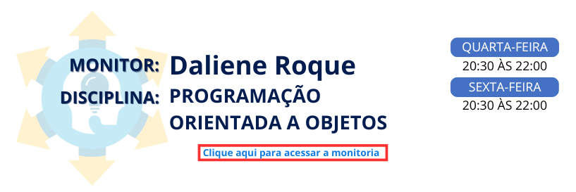

<div align="center">

# ☕ Monitoria de Programação Orientada a Objetos (POO) - Java

### Programa Ampliar • Unicesumar • 2026



Aprenda os principais conceitos de **Programação Orientada a Objetos em Java** por meio de exemplos práticos, exercícios e desafios desenvolvidos durante as monitorias.


</div>

---

## 📚 Sobre este repositório

Este repositório reúne os **materiais, exemplos, exercícios e desafios** utilizado as monitorias de **Programação Orientada a Objetos (POO) em Java**.

Aqui você encontrará:

- 📖 Exemplos desenvolvidos durante as monitorias;
- 💻 Exercícios práticos;
- 🎯 Desafios para fixação;
- 📂 Códigos-fonte completos;
- ❓ Dúvidas frequentes;
- 🚀 Material complementar para estudo.

O **objetivo** é proporcionar um ambiente organizado para que os alunos possam revisar os conteúdos, praticar programação e desenvolver gradualmente seus conhecimentos em Java e POO.

---

## 🎥 Aulas da Monitoria

Acesse as aulas pelo link abaixo:

🔗 https://sites.google.com/view/programa-ampliar/2026/tecnologia-532026/programa%C3%A7%C3%A3o-orientado-a-objetos

---

# 🗂️ Cronograma das Monitorias

| Semana | Conteúdo | Situação |
|:------:|----------|:--------:|
| ✅ 01 | Classes e Objetos | Concluído |
| ✅ 02 | Atributos, Métodos e Construtores | Concluído |
| ⏳ 03 | Encapsulamento | Em breve |
| ⏳ 04 | Herança | Em breve |
| ⏳ 05 | Polimorfismo | Em breve |
| ⏳ 06 | Classes Abstratas e Interfaces | Em breve |
| ⏳ 07 | Projeto Prático Integrador de POO | Em breve |

---

# 📁 Organização do Repositório

```text
📦 Programa-Ampliar-Unicesumar-2026
│
├── 📂 Semana-01-Classes-e-Objetos
├── 📂 Semana-02-Atributos-Metodos-Construtores
├── 📂 Semana-03-Encapsulamento
├── 📂 Semana-04-Heranca
├── 📂 Semana-05-Polimorfismo
├── 📂 Semana-06-Classes-Abstratas-e-Interfaces
├── 📂 Semana-07-Projeto-Pratico
│
├── 📂 DúvidasFrequentes
└── 📂 Recursos
```

---

# 🎯 O que você encontrará em cada semana?

Cada pasta semanal poderá conter:

- 📘 Explicação do conteúdo;
- 💻 Código apresentado durante a monitoria;
- ✍️ Exercícios propostos;
- 🚀 Desafios extras;
- 💡 Comentários no código para facilitar o aprendizado;
- 📝 Materiais complementares.

---

# 💻 Tecnologias utilizadas

- Java
- Visual Studio Code
- Git
- GitHub

---

# 🌟 Como utilizar este repositório

1️⃣ Escolha a semana

Acesse a pasta correspondente ao conteúdo que deseja estudar.

2️⃣ Estude o conteúdo

Leia as explicações e observe os exemplos apresentados durante a monitoria.

3️⃣ Execute os exemplos

Abra os códigos no Visual Studio Code ou utilize um compilador Java online, como o MyCompiler.

4️⃣ Resolva os exercícios

Tente desenvolver os exercícios sem consultar a solução inicialmente.

5️⃣ Pratique os desafios

Depois de concluir os exercícios, tente resolver os desafios extras para reforçar o conhecimento.

6️⃣ Consulte as dúvidas frequentes

Caso encontre alguma dificuldade, consulte a pasta Dúvidas-Frequentes.

---

# 📚 Conteúdos de POO

Ao longo das monitorias, serão trabalhados conceitos fundamentais de Programação Orientada a Objetos:

```text
        Classes
           ↓
        Objetos
           ↓
       Atributos
           ↓
        Métodos
           ↓
     Construtores
           ↓
    Encapsulamento
           ↓
        Herança
           ↓
    Polimorfismo
           ↓
  Classes Abstratas
           ↓
      Interfaces
           ↓
   Projeto Prático
```

<div align="center">

## 🚀 Bons estudos e boa programação!

*"A melhor forma de aprender programação é programando."*

</div>


<div align="center"> 

[](https://www.linkedin.com/in/daliene-roque-a5b167269/)
[](https://github.com/DalieneRoque)
[](https://www.youtube.com/channel/UCzS1CS4ll7-4kWyIwYVhz9w)
[](https://discord.gg/5EsYDnNDky)
[](https://www.instagram.com/dalieneroque/)
[](https://linktr.ee/dalieneroque)

</div>

<div align="center">

Daliene Nonato Lima Roque

</div>